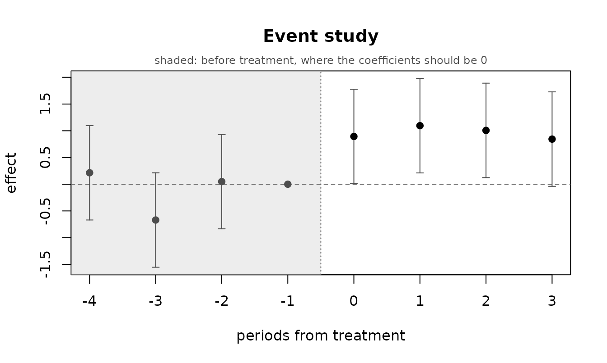
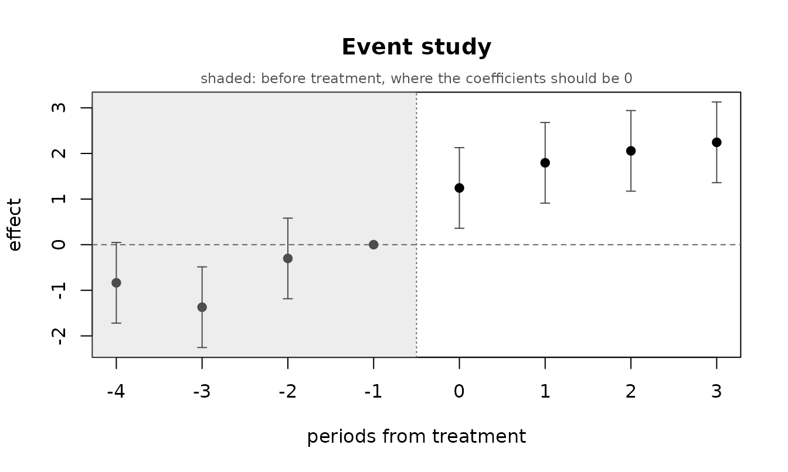
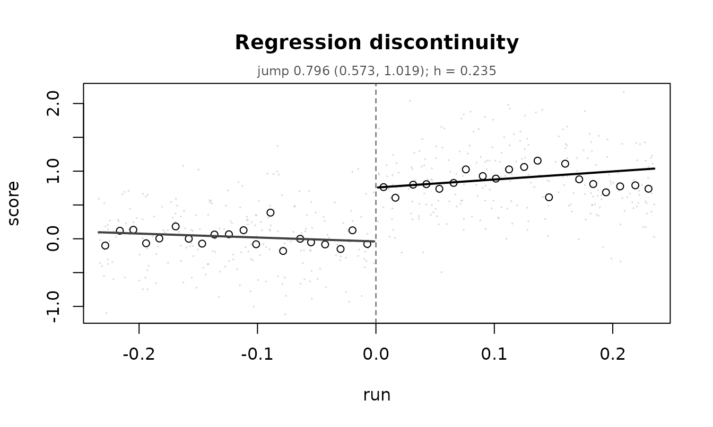

# Causal models: DAGs, difference in differences, regression discontinuity

A regression coefficient is an association. Turning one into a causal
claim takes an argument that lives outside the data, and this vignette
covers the three illume supports: a causal graph you supply, a
difference in differences, and a regression discontinuity.

What they share is that each names an assumption, and each lets that
assumption be checked at least partly. The functions here put the check
in the same object as the estimate, so it is hard to report one without
the other.

## The one rule

**The design fixes which regression is fitted, and nothing searches over
it.**

That matters more than it might sound. If you try specifications until
the diagnostics look good and then report the winner’s p-values, those
p-values are no longer what they claim: you have used the data twice,
once to choose and once to test. illume’s coverage is nominal across 23
designs precisely because nothing does that.

So
[`ilm_dag_model()`](https://huttoncp.github.io/illume/reference/ilm_dag_model.md)
takes the mean structure from the graph and leaves it alone. What it
*will* adjust, when a diagnostic asks, is the **error** structure – a
model for the dispersion, a random effect for grouping. Those change
what the standard errors are, not which effect is being estimated. Every
step is recorded and printed as it happens.

## Part 1: a causal graph

### Writing one down

[`ilm_dag()`](https://huttoncp.github.io/illume/reference/ilm_dag.md)
reads the `dagitty` text form, an edge list, or a `dagitty` object.

``` r

g <- ilm_dag("dag {
  treatment [exposure]
  recovery  [outcome]
  severity -> treatment
  severity -> recovery
  treatment -> recovery
  age -> severity
  age -> recovery
}")
g
#> <ilm_dag> 4 variables, 5 edges
#>   exposure: treatment
#>   outcome:  recovery
#>   edges:
#>     severity -> treatment
#>     severity -> recovery
#>     treatment -> recovery
#>     age -> severity
#>     age -> recovery
```

The graph algorithms are written in illume rather than taken from
`dagitty`, which imports V8 – a JavaScript engine is a heavy thing to
require of someone who wants to fit a regression. `dagitty` is in
`Suggests` and the test suite pins these functions to it: across 400
random graphs, 1564 d-separation tests with no disagreements, 391 of 391
identical adjustment sets, and 2532 implied claims all confirmed.

### What has to be adjusted for

``` r

ilm_adjust_sets(g)
#> [[1]]
#> [1] "severity"
#> 
#> attr(,"exposure")
#> [1] "treatment"
#> attr(,"outcome")
#> [1] "recovery"
#> attr(,"pool")
#> [1] "severity" "age"     
#> attr(,"unobserved")
#> character(0)
```

`severity` closes the back door. `age` does not need to be in the set as
well, because conditioning on `severity` already blocks the path through
it.

The interesting case is when nothing works:

``` r

ilm_adjust_sets(g, observed = c("treatment", "recovery", "age"))
#> list()
#> attr(,"exposure")
#> [1] "treatment"
#> attr(,"outcome")
#> [1] "recovery"
#> attr(,"pool")
#> [1] "age"
#> attr(,"unobserved")
#> [1] "severity"
```

An empty result is a **finding**. It says that with these variables
measured, no regression estimates this effect. That is the most useful
thing a graph can tell you, and it can only be said before the modelling
rather than after.

### What the graph claims about the data

Every missing arrow is a testable claim.
[`ilm_dag_implied()`](https://huttoncp.github.io/illume/reference/ilm_dag_implied.md)
lists them and
[`ilm_dag_test()`](https://huttoncp.github.io/illume/reference/ilm_dag_test.md)
checks them:

``` r

ilm_dag_implied(g)
#>           x   y    given
#> 1 treatment age severity
```

The conditioning set is minimal – no member can be dropped. Conditioning
on both variables’ parents always works and is the usual textbook basis,
but it is often much larger than it needs to be, and every unnecessary
covariate costs power and invites a modelling error of its own.

``` r

n <- 800
age      <- rnorm(n)
severity <- 0.7 * age + rnorm(n)
treatment <- rbinom(n, 1, plogis(0.8 * severity))
recovery <- 1.2 * treatment - 0.9 * severity + 0.5 * age + rnorm(n)
d <- data.frame(age, severity, treatment, recovery)

ilm_dag_test(g, d)
#>   testing 1 conditional independency implied by the graph
#>   the data are consistent with the graph on every claim tested
#>           x   y    given   n     estimate   p_value     p_adj verdict note
#> 1 treatment age severity 800 -0.007021139 0.7460935 0.7460935      OK
```

A failed claim does not say which side is at fault. The graph may be
missing an arrow, or a variable may not measure what its name supposes.
Both are worth knowing before any estimate is taken seriously. Note the
two thresholds: a claim counts as contradicted only if it is both
significant after adjustment *and* larger than `min_effect`. With a few
thousand rows a correlation of 0.03 is significant and means nothing.

### The whole workflow

``` r

fit <- ilm_dag_model(g, d)
#> == DAG-guided analysis ==
#> [1/6] graph and data
#>   4 variables in the graph; 4 of the 4 observed ones found in the data
#> [2/6] does the data agree with the graph?
#>   testing 1 conditional independency implied by the graph
#>   the data are consistent with the graph on every claim tested
#> [3/6] identification
#>   effect of `treatment` on `recovery`
#>   1 minimal adjustment set:
#>     {severity}
#> [4/6] response and error structure
#>   `recovery`: continuous values from -3.58 to 4.25 -> family "gaussian"
#>   no grouping structure found outside the graph
#> [5/6] fitting 1 model (the mean structure is fixed by the graph)
#>   set 1 of 1: recovery ~ treatment + severity
#>       spread check: INCONCLUSIVE
#> [6/6] results
```

``` r

fit
#> <ilm_dag_model> treatment -> recovery 
#>   family: gaussian
#>   graph vs data: OK (1 claim tested) 
#> 
#>   effect of treatment by adjustment set:
#>     [1] severity                     treatment        1.2461  ( 1.0876,  1.4046)  p = <1e-04
```

Compare that with ignoring the graph entirely:

``` r

coef(ilm_model(recovery ~ treatment, data = d, family = "gaussian",
               verbose = FALSE))["treatment"]
#> treatment 
#> 0.6299444
```

The truth is 1.2. Adjusting for what the graph says to adjust for
recovers it; not adjusting does not.

### Several adjustment sets are a sensitivity analysis

When more than one minimal set is admissible, all of them are fitted.
They target the same quantity, so if the graph is right they should
agree.

``` r

g2 <- ilm_dag("dag {
  x [exposure] ; y [outcome]
  u -> a -> x ; u -> b -> y ; x -> y
}")
ilm_adjust_sets(g2)
#> [[1]]
#> [1] "u"
#> 
#> [[2]]
#> [1] "a"
#> 
#> [[3]]
#> [1] "b"
#> 
#> attr(,"exposure")
#> [1] "x"
#> attr(,"outcome")
#> [1] "y"
#> attr(,"pool")
#> [1] "u" "a" "b"
#> attr(,"unobserved")
#> character(0)
```

The back-door path can be blocked at `a`, at `u`, or at `b`. Agreement
across the three supports the graph; a set that disagrees markedly is
worth more attention than any single point estimate.

### Reading it back in words

``` r

ilm_interpret(fit, ame = FALSE)
#> INTERPRETATION (DAG-identified effect)
#> ======================================
#> 
#> The model
#>   The effect of treatment on recovery, identified by adjusting for severity
#>   -- a minimal sufficient set under the supplied causal graph. A gaussian
#>   model of recovery, fitted to 800 observations.
#> 
#> What it says
#>   treatment: very strong evidence that a higher treatment leads to a higher
#>   value of recovery (estimate 1.246, 95% interval 1.088 to 1.405, p =
#>   <1e-04).
#> 
#>   severity: very strong evidence that a higher severity leads to a lower
#>   value of recovery (estimate -0.653, 95% interval -0.721 to -0.586, p =
#>   <1e-04).
#> 
#> What the checks found
#>   The graph itself was tested against the data on 1 implied conditional
#>   independence(s): OK. The data are consistent with the graph, which
#>   supports but does not prove it.
#> 
#>   All 5 fitting checks passed: the optimiser converged, the gradient is at
#>   zero and the information matrix is usable. These say the fit is sound,
#>   not that the model is right -- for that, run ilm_appraise().
#> 
#> How far to trust it
#>   This model has no random or smooth terms, so its t and F tests are exact
#>   rather than large-sample approximations.
#> 
#>   Causal language here rests entirely on the graph being right. It is an
#>   assumption you supplied, not something the data established.
```

Note that this says “leads to” rather than “is associated with”, and
says why. Without a design that identifies an effect,
[`ilm_interpret()`](https://huttoncp.github.io/illume/reference/ilm_interpret.md)
will not use causal language at all – and it tells you that the licence
rests on the graph being right, which is an assumption you supplied
rather than something the data established.

## Part 2: difference in differences

Some units get treated at a point in time, others do not, and the
comparison is between the two groups’ *changes* rather than their
levels.

``` r

panel <- expand.grid(unit = 1:40, time = 1:8)
panel$treated <- as.integer(panel$unit <= 20)
panel$post    <- as.integer(panel$time >= 5)
panel$y <- 1 + 0.3 * panel$time + rnorm(40)[panel$unit] +
  0.8 * panel$treated * panel$post + rnorm(nrow(panel))

did <- ilm_did(panel, "y", "unit", "time", treated = "treated", post = "post")
#> == difference in differences ==
#> [1/5] design
#>   40 units over 8 periods: 20 treated, 20 control
#>   treatment starts at time = 5
#>   4 pre-treatment periods
#> [2/5] response
#>   `y`: continuous values from -2.98 to 7.76 -> family "gaussian"
#> [3/5] estimate
#>   ATT = 1.0617  (0.6160, 1.5075)  p = <1e-04
#> [4/5] parallel trends, before treatment
#>   difference in pre-treatment slope: 0.0076 (se 0.1480), p = 0.959 -- OK
#> [5/5] event study
#>   8 periods relative to treatment (reference -1); 0 pre-treatment coefficient(s) exclude zero
```

``` r

did
#> <ilm_did> y ~ treatment  | 20 treated, 20 control units
#>   family: gaussian   random intercept: unit  
#> 
#>   ATT    1.0617  ( 0.6160,  1.5075)  p = <1e-04
#> 
#>   parallel trends before treatment: OK  (slope difference 0.0076, p = 0.959)
#>   event study: 8 periods, 0 pre-treatment coefficient(s) excluding zero  (ilm_plot_did)
```

The estimate is an interaction in a mixed model, so the fit is an
ordinary `ilm_model` and every method and diagnostic in the package
applies to it.

### Parallel trends

The identifying assumption is that without the treatment the two groups
would have moved together. That cannot be checked where it matters – it
concerns a world that did not happen – but it can be checked *before*
the treatment, and the event study shows the shape of any departure:

``` r

ilm_plot_did(did)
```



Pre-treatment coefficients should sit near zero. Here is what a
violation looks like:

``` r

bad <- panel
bad$y <- bad$y + 0.35 * bad$treated * bad$time   # already diverging
did_bad <- ilm_did(bad, "y", "unit", "time", treated = "treated",
                   post = "post", verbose = FALSE)
did_bad$parallel$status
#> [1] "FAIL"
ilm_plot_did(did_bad)
```



Getting that check calibrated took choosing the right reference
distribution. The comparison is between two groups of *units’* slopes,
so units are the independent replicates and the large-sample normal is
too generous when there are few: it rejected 6.0%, 6.8% and 5.0% of the
time at 40, 20 and 80 units, where `t` on `units - 2` gave 4.8%, 5.5%
and 4.5%. A check that cries wolf is worse than no check, because the
remedy for a failed parallel-trends test is to abandon the design.

### Staggered adoption is refused

When units are treated at different times, a pooled two-way fixed
effects estimate is **not** an average treatment effect if the effect
varies: already-treated units end up serving as controls for
later-treated ones.

``` r

stag <- panel
start <- ifelse(stag$unit <= 10, 4, ifelse(stag$unit <= 20, 6, Inf))
stag$treatment <- as.integer(stag$time >= start)
ilm_did(stag, "y", "unit", "time", treatment = "treatment", verbose = FALSE)
#> Error:
#> ! adoption is staggered, so a single pooled estimate would be misleading. Pass allow_staggered = TRUE to get it anyway with the caveat attached, restrict the data to one adoption cohort, or use a cohort-based estimator.
```

`allow_staggered = TRUE` returns the estimate with the caveat attached.
The honest remedy is a cohort-based estimator – the `did` and `fixest`
packages implement them – and illume does not have one.

### Serial correlation

Repeated observations of the same unit are correlated, and difference in
differences with naive standard errors over-rejects badly as a result. A
unit random intercept is fitted by default; `ar = TRUE` adds AR(1) on
top, which is what matters when the correlation decays rather than being
constant.

## Part 3: regression discontinuity

Treatment is assigned by whether a running variable crosses a cutoff, so
units just either side are comparable and the jump at the cutoff is the
effect.

``` r

n <- 2000
run <- runif(n, -1, 1)
score <- 0.5 * run + 0.8 * (run >= 0) + rnorm(n, 0, 0.5)
rd <- ilm_rdd(data.frame(run = run, score = score), "score", "run", cutoff = 0)
#> == regression discontinuity ==
#> [1/6] design
#>   2000 rows: 994 below the cutoff, 1006 at or above
#> [2/6] response and bandwidth
#>   `score`: continuous values from -2.01 to 2.92 -> family "gaussian"
#>   bandwidth 0.2352 (rule of thumb -- a starting point, not an optimum;
#>     see $bandwidth, and rdrobust for a chosen one)
#> [3/6] estimate
#>   224 below and 248 above within the bandwidth
#>   jump = 0.7963  (0.5732, 1.0194)  p = <1e-04
#> [4/6] bandwidth sensitivity
#>   estimate ranges 0.7346 to 0.7963 across 0.5x to 2x the bandwidth
#> [5/6] design checks
#>   density at the cutoff: 224 below, 248 above, p = 0.527 -- OK
#>   covariate balance: no covariates given
#> [6/6] placebo cutoffs
#>   0 of 4 placebo cutoffs show a jump
```

``` r

rd
#> <ilm_rdd> score at run = 0 
#>   local linear fit, triangular kernel, h = 0.2352 (224 below, 248 above)
#>   family: gaussian 
#> 
#>   jump   0.7963  ( 0.5732,  1.0194)  p = <1e-04
#>   across bandwidths 0.5x-2x: 0.7346 to 0.7963
#> 
#>   design checks
#>     density at the cutoff: OK (224 below, 248 above)
#>     placebo cutoffs:      0 of 4 show a jump
#> 
#>   Interval is the ordinary one for a weighted local fit. For
#>   bias-corrected robust intervals see the rdrobust package.
ilm_plot_rdd(rd)
```



### The design checks

A regression discontinuity is only as good as the claim that crossing
the cutoff is the *only* thing that changes there. Four things check
that.

**Density.** If people can move themselves across the cutoff, the ones
just above are not comparable to the ones just below.

``` r

rd$density$status
#> [1] "OK"
```

The test is whether the density is *discontinuous* at the cutoff, not
whether it is *symmetric* about it – and the difference is not academic.
Comparing raw counts either side against a 50/50 split flagged 76% of a
perfectly smooth sloped normal and 100% of a smooth exponential, over
500 unmanipulated data sets. A local linear density fitted on each side
and compared at the cutoff held between 4.6% and 6.0% across uniform,
normal and exponential running variables, and had more power as well:
with 30% of the units just below the cutoff moved above it, the count
split caught 81% and the local linear fit 98%.

**Covariate balance.** Anything measured before treatment should not
jump.

``` r

covs <- data.frame(run = run, score = score,
                   prior = rnorm(n), leaky = rnorm(n) + 0.9 * (run >= 0))
rd2 <- ilm_rdd(covs, "score", "run", cutoff = 0,
               covariates = c("prior", "leaky"), verbose = FALSE)
rd2$balance
#>   covariate   estimate        se      p_value status
#> 1     prior 0.06657325 0.2421857 7.835258e-01     OK
#> 2     leaky 1.04306073 0.2423753 2.048483e-05   FAIL
```

`leaky` jumps, which means something other than treatment changes at the
cutoff and the estimate absorbs it.

**Placebo cutoffs and bandwidth sensitivity.**

``` r

rd$placebo
#>       cutoff    estimate        se   p_value status
#> 1 -0.6725431  0.06642467 0.1103394 0.5474521     OK
#> 2 -0.3533191  0.12316501 0.1115728 0.2702182     OK
#> 3  0.3313668  0.06319596 0.1304218 0.6282401     OK
#> 4  0.6841902 -0.11875060 0.1093612 0.2780819     OK
rd$bandwidth
#>   multiplier         h   n  estimate         se     lower     upper
#> 1       0.50 0.1176202 241 0.7346339 0.15817710 0.4230212 1.0462465
#> 2       0.75 0.1764303 345 0.7362564 0.13215994 0.4763051 0.9962078
#> 3       1.00 0.2352404 472 0.7962914 0.11351337 0.5732325 1.0193504
#> 4       1.50 0.3528605 686 0.7840213 0.09231232 0.6027708 0.9652717
#> 5       2.00 0.4704807 909 0.7404174 0.08013887 0.5831377 0.8976970
#>        p_value
#> 1 5.656037e-06
#> 2 5.148098e-08
#> 3 8.101311e-12
#> 4 1.257128e-16
#> 5 1.727623e-19
```

An effect that appears only in a narrow window is not an effect.

### What this does not do

The interval is the ordinary one for a weighted local fit. It does
**not** carry the bias correction that a wide bandwidth calls for;
`rdrobust` implements the Calonico–Cattaneo–Titiunik intervals and does
it well. The default here is local **linear** for a reason: a high-order
global polynomial produces estimates driven by points far from the
cutoff and is a documented way to manufacture a discontinuity.

Fuzzy assignment – where crossing the cutoff changes the *probability*
of treatment without determining it – is detected and not reported as
sharp, since the jump is then the effect of being eligible rather than
of being treated.

## Choosing among the three

|  | identifying assumption | checkable? |
|----|----|----|
| [`ilm_dag_model()`](https://huttoncp.github.io/illume/reference/ilm_dag_model.md) | the graph is right, and the adjustment set is measured | partly: the implied independencies |
| [`ilm_did()`](https://huttoncp.github.io/illume/reference/ilm_did.md) | parallel trends | partly: the pre-treatment periods |
| [`ilm_rdd()`](https://huttoncp.github.io/illume/reference/ilm_rdd.md) | nothing else changes at the cutoff | partly: density, balance, placebos |

None of them is checkable where it matters, which is the part that
concerns a counterfactual. Everything above makes an assumption more or
less plausible; none of it makes one true.

## See also

[`vignette("regression-models")`](https://huttoncp.github.io/illume/articles/regression-models.md)
for the modelling engine and its diagnostics,
[`vignette("exploring-data")`](https://huttoncp.github.io/illume/articles/exploring-data.md)
for the exploration side, and
[`vignette("effect-size-and-power")`](https://huttoncp.github.io/illume/articles/effect-size-and-power.md)
for
[`ilm_scenario()`](https://huttoncp.github.io/illume/reference/ilm_scenario.md),
which turns a fitted causal model into the projection a decision needs.
Mediation – how much of an effect runs THROUGH something else – is
[`ilm_mediate()`](https://huttoncp.github.io/illume/reference/ilm_mediate.md),
documented in
[`vignette("regression-models")`](https://huttoncp.github.io/illume/articles/regression-models.md).
